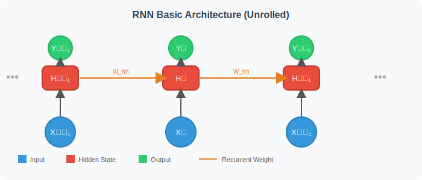
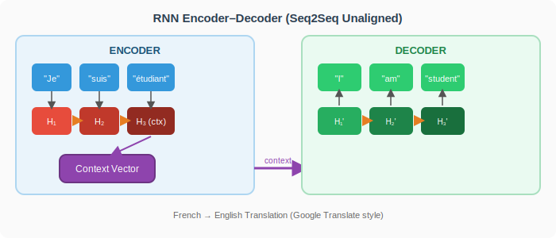
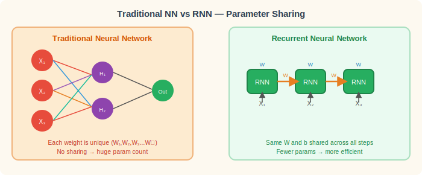
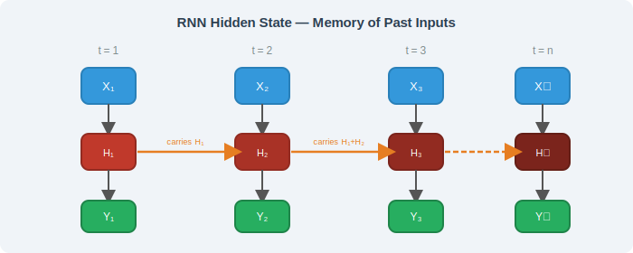
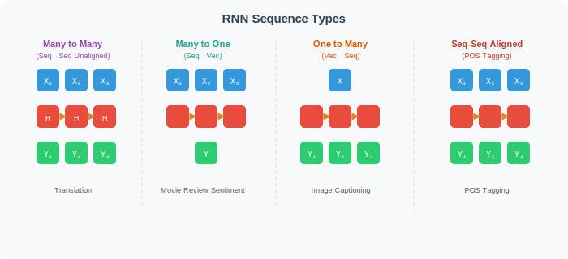

# Recurrent Neural Networks (RNN) — Comprehensive Notes

---

## 1. RNN Works Well with Sequences of Data

RNN (Recurrent Neural Network) is a specialized class of neural networks specifically designed to handle **sequential data**, where the order of inputs matters. Unlike traditional feedforward networks that treat each input independently, RNNs maintain a notion of "time" — each step in the sequence influences the next. This makes RNNs naturally suited for problems where context from earlier inputs is needed to understand or predict later ones. Think of it like reading a sentence word by word: the meaning of the last word often depends on everything that came before it.

---

## 2. Applications — Time Series and Forecasting

RNNs excel at **time series data** because real-world data like stock prices, weather patterns, and sales numbers are inherently sequential — each data point depends on prior values. In **stock forecasting**, an RNN can learn patterns such as weekly cycles or momentum trends by remembering past prices as it predicts the next value. **Sales forecasting** similarly benefits from RNNs, as they can model seasonal trends, promotional effects, and demand patterns over time. Beyond finance and retail, any domain involving ordered numerical data — sensor readings, energy consumption, website traffic — is a strong candidate for RNN-based modeling.

---

## 3. Time Series Analysis

A **time series** is a sequence of data points collected at successive, equally spaced points in time — such as daily temperature, hourly electricity consumption, or monthly revenue figures. RNNs model time series by feeding one timestep at a time into the network, allowing it to capture temporal dependencies that span many steps back. The hidden state of the RNN acts as a "running summary" of everything observed so far, making it a natural fit for forecasting the next value in the sequence. Unlike simple regression models, an RNN can detect non-linear patterns and long-range correlations without the user having to manually engineer lag features.

---

## 4. Google Translation

**Google Translate** is one of the most iconic real-world deployments of RNN-based architectures, specifically the **Encoder–Decoder (Seq2Seq)** model. The encoder RNN reads the source language sentence word by word and compresses its meaning into a fixed-size **context vector**. The decoder RNN then reads that context vector and generates the target language translation word by word. Because languages have different grammar structures (e.g., verb-at-end in German vs. verb-in-middle in English), the unaligned Seq2Seq model allows the decoder to produce output of a different length and word order than the input. Modern translation systems have evolved to use Transformer attention on top of this foundational idea.

---

## 5. NLP Applications — Gmail Auto-completion and Entity Recognition

RNNs power many **Natural Language Processing (NLP)** tasks because language is fundamentally sequential — words have meaning only in context. **Gmail's Smart Compose** (text auto-completion) uses sequence models to predict what the user is likely to type next, based on the words already typed in the current sentence and the broader email context. **Named Entity Recognition (NER)** is another key NLP task where RNNs scan through a sentence and label each word (e.g., "Apple" = Company, "Tim Cook" = Person, "Cupertino" = Location). Because the model reads the full sequence before making a tag decision, it can resolve ambiguity — for instance, "Apple" means fruit or company depending on surrounding words.

---

## 6. Why Exactly RNN? — The Variable Input Length Problem

One fundamental limitation of traditional neural networks is that they require **fixed-size inputs** — you must decide in advance how many input features the network will receive. In language tasks, sentences vary in length from 3 words to 300 words, so mapping them to a fixed-size input requires arbitrary padding or truncation, which discards information or introduces noise. RNNs solve this elegantly by processing **one token at a time**, regardless of the total sequence length — the same network handles a 5-word sentence and a 50-word paragraph without any structural change. This architectural flexibility is why RNNs became the backbone of NLP before Transformers arrived.

---

## 7. Static Input Features Problem in Traditional NN

In a standard feedforward neural network, every input neuron corresponds to a **specific named feature** (e.g., input₁ = age, input₂ = salary). If your sequence is longer than expected or you have missing features, you must pad with zeros or drop data — there is no graceful mechanism to handle "extra" or "missing" timesteps. This is especially problematic in NLP where vocabulary is vast and sentence structure is unpredictable. Traditional NNs also cannot share learned patterns across positions — what the network learns about position 1 doesn't transfer to position 10. RNNs sidestep this entirely by using the **same cell and weights** across all positions, effectively learning position-independent sequence patterns.

---

## 8. Neural Networks Work on Numbers — Too Much Computation

All neural networks ultimately operate on **numerical tensors**, which means text, images, and signals must be converted to numbers before processing. For traditional NNs applied to sequences, the input layer must be as large as the longest possible sequence multiplied by the feature dimensionality — a sentence of 100 words with word embeddings of size 300 means 30,000 input neurons. This leads to an **explosion in the number of parameters** (weights), making the model slower to train, prone to overfitting, and memory-intensive. RNNs avoid this blowup by unrolling the same small recurrent cell over time, so the parameter count stays constant regardless of sequence length, dramatically reducing computational overhead.

---

## 9. No Parameter Sharing in Traditional NN

In a standard fully-connected network, each connection between layers has a **unique, independent weight** — W₁₁, W₁₂, W₂₁, etc. This means patterns learned at position 1 of the input have no relationship to patterns at position 5, even if the same word appears at both positions. The network must independently re-learn the same concept at every position, wasting capacity and requiring far more training data. This lack of parameter sharing also makes the model very sensitive to slight shifts in input position — moving "not" from word 3 to word 5 in a sentence can completely fool the network. Parameter sharing is one of the core inductive biases that makes RNNs (and CNNs) far more data-efficient than plain MLPs for structured data.

---

## 10. In RNN — It Shares Bias and Weight Across Inputs

The key innovation of RNNs is **weight sharing across time steps** — the same weight matrix `W_hh` (hidden-to-hidden), `W_xh` (input-to-hidden), and bias vector `b` are reused at every position in the sequence. This is analogous to a convolution kernel sliding across an image — the same detector is applied everywhere. When the RNN sees the word "bank" at step 3, it applies exactly the same transformation as when it sees "bank" at step 15, relying on the hidden state to carry context that disambiguates meaning. This shared parameterization drastically reduces the total parameter count, makes the model generalizable to variable-length sequences, and ensures that learned patterns transfer across positions.

---

## 11. RNN Has Memory of Past Inputs to Predict the Next Word

The defining feature of RNNs is their **recurrent connection** — at each timestep `t`, the hidden state `hₜ` is computed from both the current input `xₜ` and the previous hidden state `hₜ₋₁`. This creates a feedback loop that allows information to persist: the hidden state effectively acts as a **compressed memory** of everything the network has seen so far. In language modeling, this means when predicting the next word, the RNN considers not just the immediately preceding word but the entire history — "The cat sat on the ..." the RNN remembers "cat" and "sat" from earlier and predicts "mat" or "floor". Without this memory, predicting coherent language would be impossible.

---

## 12. Hidden States Store the History

The **hidden state vector** `hₜ` is the RNN's working memory — a fixed-size numerical summary of all inputs seen up to timestep `t`. At each step, the new hidden state is computed as: `hₜ = tanh(W_xh · xₜ + W_hh · hₜ₋₁ + b)`, blending the current input with the inherited history. Over many timesteps, the hidden state learns to selectively retain important context (e.g., the grammatical subject of a sentence) and forget irrelevant noise. Because the hidden state has a fixed dimensionality (say, 256 or 512 units), the RNN must learn a lossy but meaningful compression of history — which is both its strength (efficiency) and its weakness (long-range forgetting, addressed by LSTM/GRU).

---

## 13. Seq → Seq (Many to Many) — Predict Sequence up to 30 Days

The **Many-to-Many (unaligned) architecture** takes a sequence as input and produces a sequence as output, where the lengths of input and output can differ. A practical example is **time series forecasting**: given 90 days of past sales data, predict the next 30 days — the input is a 90-step sequence and the output is a 30-step sequence, implemented via an Encoder–Decoder RNN. Another classic example is **machine translation**, where a sentence in French of length 7 becomes a sentence in English of length 6. The "unaligned" designation means there's no direct one-to-one correspondence between input and output positions — the encoder first reads the full input and the decoder generates the full output guided by the context vector.

---

## 14. Seq → Vec (Many to One) — Movie Review Sentiment

The **Many-to-One architecture** processes an entire input sequence but produces only a **single output** at the end. After reading all words in a movie review (which could be 100+ words), the RNN distills the entire sequence into one hidden state vector, which is then passed through a classifier to produce a sentiment label like "positive" or "negative." This is useful whenever you need a global judgment over a full sequence: email spam detection, document classification, question answering, or clinical notes summarization all use this pattern. The final hidden state is the bottleneck that must encode everything relevant about the sequence — hence, the model must learn what to remember and what to discard along the way.

---

## 15. Vec → Seq (One to Many) — Image to Caption

The **One-to-Many architecture** takes a **single fixed-size input** (a vector) and generates an entire output sequence. The most famous application is **image captioning**: a CNN encodes an image into a feature vector, which is fed to an RNN decoder that then generates a textual description one word at a time ("A dog running on a beach"). The initial vector "seeds" the hidden state of the RNN, and the network proceeds to generate tokens autoregressively — each output word becomes the next input, building the caption step by step. This architecture is also used in **music generation** (one seed chord → full melody) and **code generation** from a specification vector.

---

## 16. Seq → Seq Aligned — POS Tagging

The **Seq-to-Seq Aligned** (also called Many-to-Many synchronized) architecture produces **one output per input timestep** — meaning input and output sequences have the same length and positions correspond directly. **Part-of-Speech (POS) tagging** is the textbook example: for each word in a sentence, the model outputs its grammatical role (noun, verb, adjective, etc.) at the exact same position. Named Entity Recognition, Chunking, and Semantic Role Labeling all follow this pattern. Unlike the unaligned Seq2Seq, there is no separate encoder–decoder bottleneck — the RNN reads the full input and at each step directly produces the aligned tag, with the hidden state providing bidirectional context (especially in Bidirectional RNNs).

---

## 17. Seq → Seq Unaligned — Encoder–Decoder for Translation

The **Encoder–Decoder** architecture is the canonical unaligned Seq2Seq model, originally introduced for **neural machine translation**. The **encoder** RNN reads the source sentence one word at a time and compresses its entire meaning into a single **context vector** (the final hidden state). The **decoder** RNN then takes this context vector as its initial state and generates the translated sentence word by word, conditioned on both the context and the previously generated words. This design cleanly separates understanding (encoder) from generation (decoder) and allows input and output sequences to have different lengths and structures. The Attention Mechanism (introduced in 2015) extended this by letting the decoder focus on different parts of the encoder's outputs at each generation step, greatly improving translation quality.

---

*Notes compiled and elaborated from original RNN concepts. Diagrams are original illustrations.*
